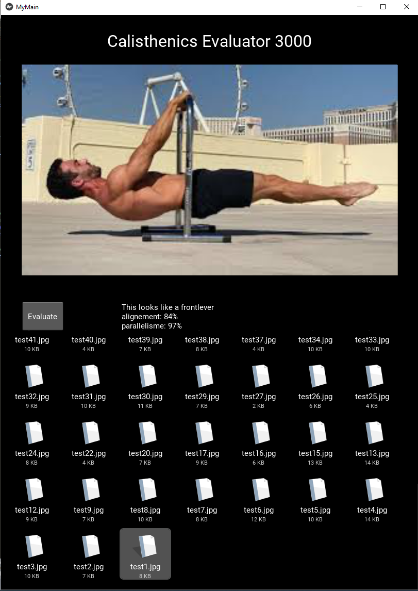

# calisthenics_evaluator_android

> :warning: **Old Project**: No longer suported 

This is a small android app that consist on an evaluator of calisthenics mouvement. \
When a picture is selected, by clicking on `evaluate`, a trained deep learning model is run on few rotation of the image. \
Then we take the rotation that gives the best detection of the body parts (head, arms, hips, legs). \
We extract center of gravity for each ones and apply deterministic rules to detect the name of the movement. \
We then calculate some quality metrics such as body alignement (alignement of the center of gravity for head, hips and legs), as weel as parallelism (body parallel to the ground).

# flaws

Currently the model is poorly accurate because it is trained for humans standing. \
To fix that we applied successive rotation which helped a lot. \
However if the model doesn't detect legs or arms, which happens quite often for the arms because there are mixed with the bar they are holding, then it will be unable to detect the movement.  \
The model also has higher detection rate if the picture is taken with too much distortion, meaning it should be actually taken as net profile instead of from the front, back, top or bottom.

In the future, a new and more elaborate model should be applied to detect more accuratly the body part, even for people not standing on their feet. 

In the future, a generalization to more calisthenics movement could also be implemented, either by training and runing small ML/DL model on the generated body parts coordinates, or by applying more deterministic rules.

# deploy

- [ ] install virtualbox and an ubuntu image
  - [ ] go to https://www.virtualbox.org/ for the virtual box
  - [ ] go to https://ubuntu.com/download/desktop for the ubuntu image
- [ ] Open the linux vm
  - [ ] on virtualbox, new > name > next > next > create> next > next > create
  - [ ] double click newly created instance, create disk by openning explorer and selecting the ubuntu image (.iso file) > start > capture
  - [ ]  install ubuntu > then go trhough all the ubuntu settings
- [ ] Setup phone
  - [ ] activate dev mode by clicking 7 times on build version
  - [ ] activate usb debuging
- [ ] Start ubuntu and setup usb
  - [ ] restart ubuntu
  - [ ] on bottom right of vm, if there is a button "no usd device attached", right click > usb setting > usb > device > select your android > ok > return to the righ click > select your android
- [ ] install requierments on vm
  - [ ] open terminal
  - [ ] install git `sudo apt install git`
  - [ ] clone buildozer `git clone https://github.com/kivy/buildozer.git`
  - [ ] install python 3 `sudo apt-get install python3.8`
  - [ ] install setup tools `sudo apt-get install python3-setuptools`
  - [ ] install buildozer `cd buildozer` > `sudo python3 setup.py install` > `cd ..`
  - [ ] clone this repo with the main.py file `git clone https://github.com/noaillypau/calisthenics_evaluator_android`
- [ ] deploy app
  - [ ] go to the cloned rdirectory `cd calisthenics_evaluator_android`
  - [ ] init buildozer `buildozer init`
  - [ ] edit the buildozer.spec file, add files needed (ex:pb here for the model loading), edit name of app, add python packages req (cv, scipy, ect), and uncomment the debugging (line 219) if necessary
  - [ ] `sudo apt update`
  - [ ] `sudo apt install -y git zip unzip openjdk-8-jdk python3-pip autoconf libtool pkg-config zlib1g-dev libncurses5-dev libncursesw5-dev libtinfo5 cmake libffi-dev`
  - [ ] `pip3 install --user --upgrade cython virtualenv`
  - [ ] `sudo apt-get install cython`
  - [ ] `buildozer android debug deploy run`
  
# Spec file and debug

- [ ] add numpy, matplotlib, scipy and opencv (instead of opencv-python which seems to generate bugs at launch) to the package used
- [ ] add pb extension to the files that must be added (it is the DL model)
- [ ] if app crash use `buildozer android logcat` once app is deploy to see the logs

  
  
# Todo List

- [ ] gui
  - [ ] Improve ui design
  - [x] sort file by most recent in the fileChooser
  - [ ] find a way to show icones for .png and .jpg
  - [ ] Improve ui design
  - [ ] Add a video option to evaluate in real time
  - [ ] Add settings menu on which we can decide if we want to show detected body joints or not on the picture
- [ ] detector
  - [ ] test a small improvement by adding more rotations
  - [ ] test some more advanced model such as smplify-x OR consider training own model on specific movement
  - [ ] increase number of detect movement (currently 2: full planche and front lever)
  
# References

* pre trained model: https://github.com/misbah4064/human-pose-estimation-opencv

* official kivy doc: https://kivy.org/doc/stable/

* official kivy api reference: https://kivy.org/doc/stable/api-index.html
